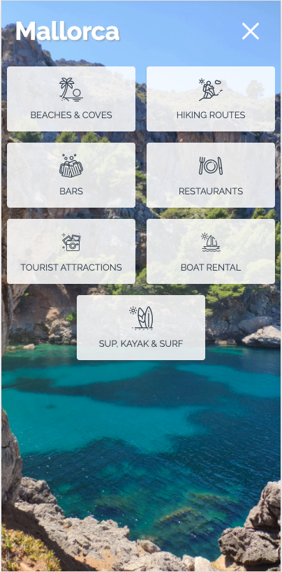
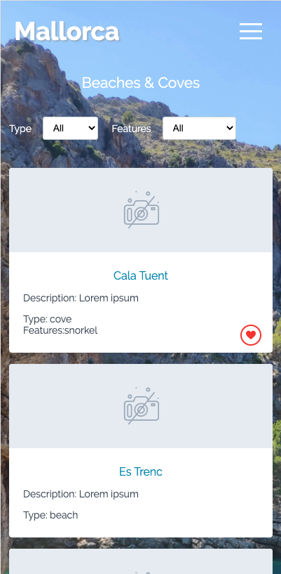

# MALLORCA·life (work in progress)

This project is temporary deployed [here](http://mallorca-life.surge.sh/) and designed for mobile resolutions

  

## Available Scripts

In the project directory, you can run:

### `npm start`

Runs the app in the development mode. 
Open [http://localhost:3000](http://localhost:3000) to view it in the browser.

The page will reload if you make edits. 
You will also see any lint errors in the console.

### `npm run build`

Builds the app for production to the `build` folder. 
It correctly bundles React in production mode and optimizes the build for the best performance.

The build is minified and the filenames include the hashes. 
Your app is ready to be deployed!

See the section about [deployment](https://facebook.github.io/create-react-app/docs/deployment) for more information.

## Deployment in Surge

Run `npm build` to generate static files
Go to /build and run `surge`

See [this post](https://daveceddia.com/deploy-create-react-app-surge/) for more information

## Analyzing the Bundle Size

This section has moved here: https://facebook.github.io/create-react-app/docs/analyzing-the-bundle-size
